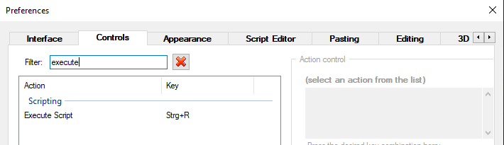
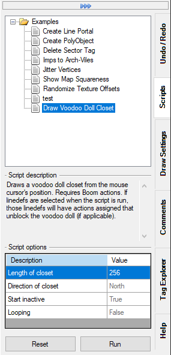

# Getting started

## Introduction

UDB Script allows the user to run custom JavaScript code on the currently opened map. This includes modifying existing map elements (like things or sectors), or creating completely new map elements (i.e. drawing lines, adding things etc.).

It uses the [Jint](https://github.com/sebastienros/jint) interpreter.

## Directory structure

Scripts are automatically found if they are placed in the correct directory structure. The directory structure is in the UDB installation folder and looks like this:

```
.\UDBScript\
.\UDBScript\Libraries\
.\UDBScript\Scripts\
```

All files ending on .js in the `Libraries` directory are loaded (parsed and executed) every time a script is run. It is used to provide common functionality to multiple script. Currently there's the Pen.js library file that simplifies drawing geometry (it's inspired by the DBX Lua Pen class).

All files ending on .js in the `Scripts` directory (and its subdirectories) are added to the Scripts docker. They are only run on the user's command.

## Setting a key to execute scripts

A key to execute a script can be set by going to `Tools` -> `Preferences` -> `Controls`, and then filtering by `execute`.



## The docker

Scripts can be accessed, configured, and run through the provided docker. Selecting a script will show it's description (if available) and configuration options.

Default values in the script options will be shown in gray, deviating values as black. Pressing the `Reset` button will reset all values to the default. 

Scripts can either be run using the `Run` button, or by pressing the assigned key (see previous section). Note that scripts might rely on the mouse cursor being somewhere in the map space, in which case they will not run correctly using the `Run` button. This should be intercepted by the script.

Currently the available scripts are only read once at start, to add new scripts you have to restart UDB.



## Writing scripts

### Script metadata

Scripts can contain metadata at the top of the file to provide information about the script as well as available script options. The metadata is specified as JavaScript template strings, i.e. strings enclosed by backticks (`` ` ``). The template string has to start with a `#`, followed by a command, followed by the payload, followed by a `;`.

!!! attention
    The template string **has** to be followed by a `;`. All script metadata has to be at the top of the file and may not be interrupted by any other constructs (like variable declaraion or assignment). If such constructs are detected parsing of the metadata will stop.

Example:
```js
`#name Super Useful Script`;
```

Currently the following metadata commands are available:

- `name`: name of the script that will be shown in the docker. If omitted the capitalized file name without the extension will be used as the script name
- `description`: description of the script. Should include what the script does and what the requirements are (for example if something has to be selected for the script to work)
- `scriptoptions`: the script options. The payload has to be in UDB's configuration file format (see below)
- `version`: the feature version the script needs to run

#### Setting script options

The script options that can be set in the docker prior to running the script can be defined using the `scriptoptions` metadata command. The payload has to be in UDB's configuration file format.

The payload consists of one or more blocks, each defining an option. The blocks have the following format:

```js
`#scriptoptions

<name>
{
    description = <description>;
    default = <defaultvalue>;
    type = <type>;
    enumvalues {
        <values>
    }
}
`;
```
!!! note
    The `eunumvalues` field is only used with the appropriate `type` value

Example:

```js
`#scriptoptions

length
{
	description = "Length of closet";
	default = 256;
	type = 0; // Integer
}

direction
{
	description = "Direction of closet";
	default = "North";
	type = 11; // Enum
	enumvalues {
		0 = "North";
		1 = "East";
		2 = "South";
		3 = "West";
	}
}
`;
```

The following types are currently available:

- 0: integer
- 1: floating point number
- 2: string
- 3: boolean
- 5: sector effect*
- 6: texture*
- 7: flat*
- 8: angle in degrees*
- 9: angle in radians*
- 10: color*
- 11: enumeration**
- 13: sector tag*
- 14: thing tag*
- 15: linedef tag*
- 17: angle in degrees as floating point number*
- 18: thing type*
- 19: thing class*
- 20: random integer
- 21: random floating point number 
- 22: byte angle*
- 23: thing radius*
- 24: thing height*
- 25: PolyObject number*

&ast; these are quality of life type for interger, floating point numbers, and strings. Clicking into their field will show context sensitive controls. For example when using type 3 (boolean) there will be drop down list where you can choose between `true` or `false`, when using type 6 (texture) a button button that will open the texture browser, when using type 13 (sector tag) will show a drop down list of sector tags in the map etc.<br>

#### Accessing script options in a script

The script option can be accessed through the global object `ScriptOptions`. This object has properties by the name of the blocks of the script option definition, and contains the value set in the docker.

Example:

```js
`#scriptoptions

length
{
	description = "Length of closet";
	default = 256;
	type = 0; // Integer
}
`;

showMessage('The given length is ' + ScriptOptions.length);
```
!!! tip
    You can also query options at runtime. See the `QueryOptions` API documentation.

### Working with map elements

Map elements (things, sectors, sidedefs etc.) can be accessed through the global `Map` object. This object has methods that return an array of map elements, for example `Map.getSectors()` returns an array of `Sector` objects, which are are all sectors in the map. There are also methods to get all selected (for example `Map.getSelectedSectors()` )and marked (for example `Map.getMarkedSectors()`) map elements. These map elements can then be modified, see the documentation for the particular map element type in the API section.

!!! note
    "Marking" a map element is a way to denote that something happened to this map element. For example when using the `Map.drawLines()` method all new geometry will be marked.

### Creating new geometry

New map geometry can be created with the `drawLines()` method of the `Map` object. It accepts an array of coordinates in map space. The coordinates can either by instances of `Vector2D`, `Vector3D`, or an array of numbers.

Example 1:

```js
Map.drawLines([
	new Vector2D(0, 0),
	new Vector2D(64, 0),
	new Vector2D(64, 64),
	new Vector2D(0, 64),
	new Vector2D(0, 0)
]);
```

Example 2:

```js
Map.drawLines([
	[ 0, 0 ],
	[ 64, 0 ],
	[ 64, 64 ],
	[ 0, 64 ],
	[ 0, 0 ]
]);
```

Both examples are equivalent. The advantage of using `Vector2D` or `Vector3D` is that they have many math related methods built-in.

Another method to draw geometry is using the `Pen` class - which iself is implemented as a library written in JavaScript. It's inspired by the DoomBuilder X class of the same name. It provides some quality of life features, since it creates coordinates relative to the current position - just like moving a pen around a sheet of paper, or [Turtle graphics](https://en.wikipedia.org/wiki/Turtle_graphics).

Naive implementation of the above example using the `Pen` class:

```js
let p = new Pen();
p.moveTo([0, 0]);
p.drawVertex();
p.moveTo([64, 0]);
p.drawVertex();
p.moveTo([64, 64]);
p.drawVertex();
p.moveTo([0, 64]);
p.drawVertex();
p.finishDrawing();
```

Using the strenghts of the `Pen` class:

```js
let p = new Pen([0, 0]);

for(let i=0; i < 4; i++)
{
	p.drawVertex();
	p.moveForward(64);
	p.turnRight();
}

p.finishDrawing();
```